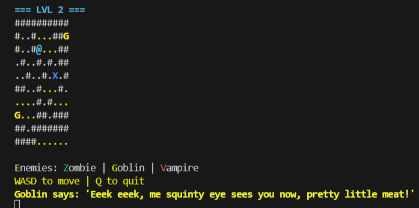

# NeuroHack 🧠⚔️

A terminal-based roguelike game powered by a Cloud-Native Generative AI architecture. 

Unlike traditional games with hardcoded monster logic, NeuroHack uses **Llama 3.1 8B** (via Groq LPU) combined with deterministic BFS pathfinding to create enemies that not only hunt the player flawlessly but also generate dynamic, personality-driven taunts in real-time.

## System Architecture

* **Backend (Cloud):** FastAPI hosted on Hugging Face Spaces. It handles map validation, path carving, BFS routing, and LLM orchestration.
* **Frontend (Local):** A Python terminal client using `rich` for UI rendering.
* **AI Inference:** Groq Cloud API for ultra-low latency LLM responses.

## How to play (Client)

1. Navigate to the `client/` directory.
2. Install requirements: `pip install requests rich`
3. Run the game: `python game_gen.py`

## Technologies Used
* Python 3
* FastAPI & Uvicorn
* Groq Cloud (Llama 3.1)
* Docker